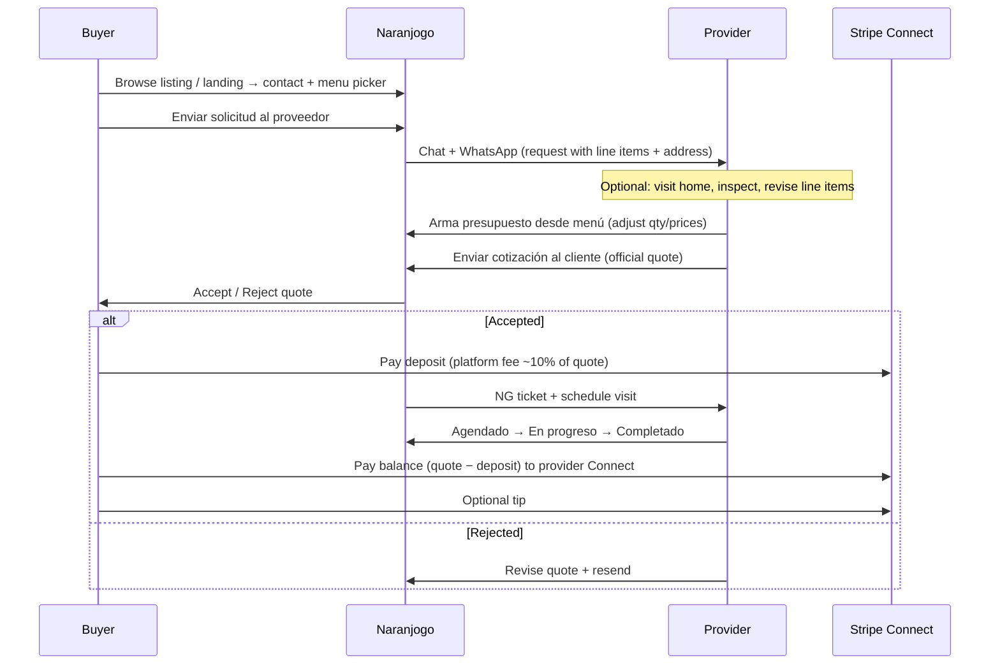

# Home Maintenance Services — Product Spec (Plumbing, Electrician, Handyman)

**Status:** Planning / not yet implemented  
**Target flow:** Same as veterinary + pet care (quote gate + deposit + balance/tip)  
**Market:** San Miguel de Allende (SMA), Guanajuato — expat + local homeowners  
**Branch (proposed):** `home-maintenance-service` from `main`

---

## Executive summary

Three **separate** service verticals share one platform flow:

| Service | Slug (existing) | ES label | Landing (proposed) |
|---------|-----------------|----------|-------------------|
| **Plumbing** | `plomero` | Plomero | `/plomeria` or `/plomero-sma` |
| **Electrician** | `electricista` | Electricista | `/electricista-sma` |
| **Handyman / home maintenance** | `mantenimiento_hogar` *(new)* | Mantenimiento del hogar / Handyman | `/mantenimiento-del-hogar` |

**No new database tables.** Reuses `listings.service_menu`, quote gate columns, and balance/tip columns already on production Supabase.

**Key product rule:** Menu prices are **reference estimates**. The provider **must** be able to adjust the official quote after a home visit (or from photos/notes) **before** the buyer accepts and pays the deposit.

---

## Why three services (not one “handyman” bucket)

| Reason | Detail |
|--------|--------|
| Search | Expats search “plumber” or “electrician” when they know the trade |
| Trust | Electrical and plumbing work has safety/licensing expectations |
| Menus | Each trade gets a focused starter menu (pipes vs outlets vs general repairs) |
| Handyman fills the gap | Painting, drywall, doors, shelves — jobs that are not clearly one trade |

Providers can still list **Otros servicios** at signup (e.g. primary = handyman, also `plomero`).

---

## End-to-end flow (same as vet / pet care)



### Step-by-step (buyer + provider)

| # | Actor | Action | System behavior |
|---|-------|--------|-----------------|
| 1 | Provider | Sign up `/unete?service=plomero` (or `electricista`, `mantenimiento_hogar`) | Menu editor + **Cargar plantilla sugerida** |
| 2 | Admin | Approve listing (`is_verified = true`) | Listing visible in search |
| 3 | Buyer | Opens listing → describes job + picks menu rows + address + preferred time | Creates contact gate + chat thread |
| 4 | Buyer | **Enviar solicitud al proveedor** | WhatsApp to provider; **not** checkout yet |
| 5 | Provider | Reviews request; may visit home or message for photos | Off-platform coordination OK |
| 6 | Provider | Opens quote builder → adds/changes line items and total | Can exceed or reduce vs buyer’s initial pick |
| 7 | Provider | **Enviar cotización al cliente** (green button) | `quote_status = pending`; buyer sees Accept/Reject |
| 8 | Buyer | **Aceptar** | Deposit unlocked (~10% of **quoted** total, min $10 MXN) |
| 9 | Buyer | Pays deposit (Stripe) | `NG-` ticket; provider notified |
| 10 | Provider | Sets appointment → **En progreso** → **Completado** | On complete: `balance_due = quote_total − deposit` |
| 11 | Buyer | **Mis reservas** → pay balance + optional tip | Stripe Connect transfer to provider |

### On-site estimate **before** acceptance (critical)

This is already how vet works (“price may change after physical exam”). For home maintenance:

1. **Buyer request** = initial intent + reference menu picks (not binding price).
2. **Provider official quote** = binding offer after inspection (or remote assessment).
3. **Buyer must Accept** before any payment — if the visit changes scope, provider **revises and resends** quote; buyer sees new total.

**Default disclaimer (all three trades):**

- **ES:** `El precio es referencia. Puede ajustarse después de la visita al domicilio, inspección del trabajo y materiales necesarios. Materiales se cotizan aparte salvo que el menú indique lo contrario.`
- **EN:** `Prices are reference only. The final quote may change after an on-site visit, job inspection, and required materials. Materials are quoted separately unless the menu states otherwise.`

**Suggested UX copy on quote panel (provider):**

- ES: *“Visita el domicilio o revisa fotos antes de enviar la cotización oficial. El cliente debe aceptar el total final antes de pagar el depósito.”*

---

## Payment model (Mexico)

Same as housekeeping / veterinary / pet care on Naranjogo today.

### Phase 1 — Deposit (at Accept)

| Item | Value |
|------|-------|
| Mode | `commission_only` |
| Base | **Agreed quote total** (`agreed_subtotal_mxn_cents`) |
| Deposit | Admin `commission_pct` on listing (default **10%**) |
| Minimum | **$10.00 MXN** (`MIN_COMMISSION_CENTS_MXN`) |
| IVA on deposit | Not charged on commission-only deposit checkout |
| Provider requirement | **Stripe Connect active** before sending official quote |

**Example — plumber job quoted at $2,500 MXN:**

| | Amount |
|---|--------|
| Quote total (pricing base) | $2,500 |
| Deposit (10%) | $250 |
| Balance due after **Completado** | $2,250 → paid to provider via Connect |

**Example — small job quoted at $650 MXN:**

| | Amount |
|---|--------|
| Quote total | $650 |
| Deposit (10%) | $65 |
| Balance due | $585 |

### Phase 2 — Balance (after Completado)

| Item | Value |
|------|-------|
| Formula | `balance_due = pricing_base_mxn_cents − commission_amount_cents` |
| Payment | Stripe Checkout → Connect transfer to provider |
| Materials | Typically included in revised quote total; disclaimer clarifies |

### Phase 3 — Tip (optional)

| Item | Value |
|------|-------|
| When | After balance paid (or alongside) |
| Copy | “100% para tu plomero / electricista / técnico” |

### What we do **not** do in v1

- Materials-only SKUs with separate cart checkout
- CFDI / factura generation (provider handles offline if needed)
- Escrow hold on full job amount upfront (deposit + balance model instead)

---

## Market reference — San Miguel de Allende vs Mexico

Prices below blend **national repair benchmarks** (Cronoshare, HomePro México) with **SMA marketplace signals** (Habitissimo Guanajuato/SMA, Jun 2026). SMA expat-facing providers often charge **10–25% above** national mid-range for bilingual service and colonial-home access (narrow streets, thick walls, older plumbing).

### SMA marketplace snapshots (Habitissimo 2026)

| Trade | SMA average job (platform) | Typical range |
|-------|---------------------------|---------------|
| Plomero (general) | ~**$2,456** | $700 – $5,300 |
| Instalación completa plomería | ~**$11,756** | $500 – $90,000 |
| Electricista (general) | ~**$17,154** | $1,758 – $90,000 *(skewed by full rewires)* |
| Cambio instalación eléctrica | ~**$10,474** | $500 – $100,000 |

*Large-job averages are not useful for menu line items; use per-task national tables for common repairs.*

### National common repairs (Cronoshare / HomePro 2026) — used to calibrate menus

| Job | Mexico range (MXN) | Naranjogo menu target (SMA mid) |
|-----|-------------------|--------------------------------|
| Reparar llave / grifo | $600 – $1,100 | **$850** |
| Reparación inodoro | $1,600 – $3,800 | **$2,200** |
| Destapar tuberías | $800 – $1,900 | **$1,200** |
| Reparar enchufe | $650 – $1,200 | **$900** |
| Cortocircuito | $2,500 – $3,200 | **$2,850** |
| Contacto / apagador nuevo | $200 – $400 | **$350** |
| Mantenimiento eléctrico visita | $800 – $2,000 | **$1,400** |
| Reparación persiana | $350 – $800 | **$550** |
| Handyman / reparaciones hogar (prom.) | $700 – $1,900 | **$1,200** visit reference |

**Naranjogo starter menus use the “SMA mid” column** — editable by each provider before publish.

---

## Service 1 — Plumbing (`plomero`)

### Landing & signup

- **URL:** `/plomeria` (proposed) → `/unete?service=plomero`
- **Hero (ES):** *“Plomeros de confianza en San Miguel — cotización clara antes de pagar.”*
- **Buyer search:** `/?category=services&q=plomero+fuga`

### Starter menu — `plumbingStarterMenu()` (proposed)

*Labor / visit reference. Materials (llaves, WC parts, boiler) billed in revised quote.*

| SKU | ES | EN | Ref. price MXN |
|-----|----|----|----------------|
| `visit_diagnostic` | Visita de diagnóstico / cotización en domicilio | On-site diagnostic visit | $500 |
| `fix_faucet` | Reparar grifo / mezcladora (mano de obra) | Faucet / mixer repair (labor) | $850 |
| `fix_toilet` | Reparación de inodoro (flapper, fill valve, leak) | Toilet repair | $2,200 |
| `unclog_drain` | Destape de drenaje / fregadero | Drain / sink unclog | $1,200 |
| `unclog_main` | Destape línea principal (referencia) | Main line unclog (reference) | $2,500 |
| `replace_shower_head` | Cambio de regadera / mano de obra | Shower head replacement (labor) | $650 |
| `fix_water_heater_minor` | Reparación menor calentador (mano de obra) | Water heater minor repair (labor) | $1,800 |
| `install_water_heater` | Instalación calentador (solo mano de obra) | Water heater install (labor only) | $3,500 |
| `leak_detection` | Detección de fugas (referencia) | Leak detection (reference) | $1,500 |
| `outdoor_faucet` | Instalación / reparación llave de jardín | Outdoor faucet install/repair | $900 |
| `gas_line_check` | Revisión instalación de gas (referencia) | Gas line inspection (reference) | $1,800 |
| `replace_stop_valve` | Cambio llave de paso | Stop valve replacement | $750 |
| `water_pressure` | Ajuste presión de agua | Water pressure adjustment | $650 |
| `travel_fee` | Visita fuera de zona / traslado | Out-of-zone travel fee | $350 |
| `emergency_surcharge` | Urgencia / fuera de horario | Emergency / after-hours surcharge | $900 |
| `materials_allowance` | Materiales (referencia — se confirma en visita) | Materials (reference — confirmed on visit) | $0 |

**Compare to SMA:** Simple visit + grifo aligns with Habitissimo floor (~$700) and Cronoshare grifo band ($600–$1,100).

---

## Service 2 — Electrician (`electricista`)

### Landing & signup

- **URL:** `/electricista-sma` (proposed) → `/unete?service=electricista`
- **Hero (ES):** *“Electricistas en San Miguel — cotización antes del depósito, saldo al terminar.”*

### Starter menu — `electricianStarterMenu()` (proposed)

| SKU | ES | EN | Ref. price MXN |
|-----|----|----|----------------|
| `visit_diagnostic` | Visita de diagnóstico eléctrico | Electrical diagnostic visit | $500 |
| `outlet_repair` | Reparar contacto dañado | Outlet repair | $900 |
| `outlet_install` | Instalar contacto nuevo (mano de obra + pieza básica) | New outlet install (labor + basic part) | $350 |
| `switch_install` | Instalar apagador / dimmer | Switch / dimmer install | $350 |
| `light_fixture` | Instalar lámpara / plafón | Light fixture install | $850 |
| `ceiling_fan` | Instalar ventilador de techo | Ceiling fan install | $1,500 |
| `short_circuit` | Reparar cortocircuito (referencia) | Short circuit repair (reference) | $2,850 |
| `breaker_replace` | Cambio de interruptor termomagnético | Breaker replacement | $1,200 |
| `panel_inspection` | Revisión de tablero / seguridad | Panel inspection / safety check | $1,400 |
| `grounding_check` | Revisión de tierras físicas | Grounding check | $2,200 |
| `gfci_install` | Instalar contacto GFCI (cocina/baño) | GFCI outlet install | $950 |
| `doorbell` | Timbre / interfón (referencia) | Doorbell / intercom (reference) | $1,100 |
| `rewire_room_ref` | Recableado un cuarto (referencia) | Single room rewire (reference) | $8,500 |
| `travel_fee` | Visita fuera de zona | Out-of-zone travel fee | $350 |
| `emergency_surcharge` | Urgencia / fuera de horario | Emergency surcharge | $900 |
| `materials_allowance` | Materiales (referencia — se confirma en visita) | Materials (reference) | $0 |

**Compare to SMA:** Outlet install at $350 matches HomePro national table ($200–$400); outlet **repair** at $900 matches Cronoshare ($650–$1,200). Full panel/rewire jobs stay as high “reference” rows — final quote set after visit.

---

## Service 3 — Handyman / Home maintenance (`mantenimiento_hogar`)

### New slug required

Add to `PROVIDER_SERVICES`:

```ts
{ value: "mantenimiento_hogar", es: "Mantenimiento del hogar / Handyman", en: "Home Maintenance / Handyman" }
```

*Existing slugs `plomero` and `electricista` stay unchanged.*

### Landing & signup

- **URL:** `/mantenimiento-del-hogar` → `/unete?service=mantenimiento_hogar`
- **Hero (ES):** *“Reparaciones, pintura y mantenimiento para casas y rentas vacacionales en SMA.”*

### Starter menu — `handymanStarterMenu()` (proposed)

| SKU | ES | EN | Ref. price MXN |
|-----|----|----|----------------|
| `visit_diagnostic` | Visita de evaluación / cotización | Assessment / quote visit | $450 |
| `hourly_labor` | Mano de obra por hora (referencia) | Hourly labor (reference) | $400 |
| `min_service_call` | Servicio mínimo (hasta 1 h) | Minimum service call (up to 1 hr) | $650 |
| `door_adjust` | Ajuste / alineación de puerta | Door adjust / align | $750 |
| `lock_change` | Cambio de chapas / cerradura | Lock / latch change | $900 |
| `drywall_patch_small` | Reparación drywall pequeña | Small drywall patch | $950 |
| `drywall_patch_medium` | Reparación drywall mediana | Medium drywall patch | $1,600 |
| `paint_touchup_room` | Retoque de pintura (cuarto pequeño) | Paint touch-up (small room) | $1,500 |
| `paint_wall_single` | Pintar un muro (referencia) | Single wall paint (reference) | $1,200 |
| `caulking_bath` | Silicona / calafateo baño o cocina | Bathroom / kitchen caulking | $900 |
| `tile_grout_repair` | Reparación de juntas (referencia) | Grout repair (reference) | $1,200 |
| `shelf_install` | Instalar repisas / soporte | Shelf / bracket install | $750 |
| `tv_mount` | Soporte TV en pared | TV wall mount | $1,100 |
| `curtain_rods` | Instalar cortineros | Curtain rod install | $650 |
| `blind_repair` | Reparación persiana | Blind repair | $550 |
| `furniture_assembly` | Ensamble mueble (referencia) | Furniture assembly (reference) | $850 |
| `screen_door` | Ajuste mosquitero / puerta | Screen door adjust | $700 |
| `travel_fee` | Visita fuera de zona | Out-of-zone travel fee | $300 |
| `materials_allowance` | Materiales (referencia) | Materials (reference) | $0 |

**Compare to SMA:** Blind repair $550 sits in Cronoshare persiana band ($350–$800). Minimum call $650 aligns with national handyman minimum-charge norms (~$600–$800 MXN equivalent for local techs).

---

## Implementation checklist (when approved)

### Config (`lib/provider-services.ts`)

- [ ] Add `mantenimiento_hogar` to `PROVIDER_SERVICES`
- [ ] Add `plomero`, `electricista`, `mantenimiento_hogar` to:
  - `PROVIDER_SERVICES_WITH_MENU`
  - `PROVIDER_SERVICES_WITH_QUOTE_ACCEPT`
  - `PROVIDER_SERVICES_WITH_SUPPLEMENT_PAYMENTS`

### Library (`lib/listing-service-menu.ts`)

- [ ] `DEFAULT_PLUMBING_DISCLAIMER_ES/EN`
- [ ] `DEFAULT_ELECTRICIAN_DISCLAIMER_ES/EN`
- [ ] `DEFAULT_HANDYMAN_DISCLAIMER_ES/EN`
- [ ] `plumbingStarterMenu()`, `electricianStarterMenu()`, `handymanStarterMenu()`
- [ ] Branch in `starterMenuForProviderSlug()`

### Copy (`lib/service-quote-vertical.ts`, `lib/service-menu-editor-copy.ts`)

- [ ] Per-slug buyer request titles, WhatsApp templates, balance/tip labels
- [ ] Checkout blocked message until quote accepted

### Landings

- [ ] `app/plomeria/page.tsx` (or shared template)
- [ ] `app/electricista-sma/page.tsx`
- [ ] `app/mantenimiento-del-hogar/page.tsx`
- [ ] Hero chips + search trade hints

### Docs

- [ ] `docs/PLUMBING_PROGRESS.md`, `docs/ELECTRICIAN_PROGRESS.md`, `docs/HANDYMAN_PROGRESS.md` (optional split)

### Database

- [ ] **No new migration** if quote gate + balance columns already applied

---

## Smoke test (all three slugs)

1. Sign up as each trade → load template → edit prices → admin approve  
2. Buyer: request with 2–3 menu lines + colonia address  
3. Provider: change total in quote builder (simulate post-visit revision) → **Enviar cotización al cliente**  
4. Buyer: **Reject** → provider revises → **Accept**  
5. Pay deposit → verify NG ticket  
6. Provider: Agendado → En progreso → **Completado**  
7. Buyer: pay balance (+ tip) in Mis reservas  
8. Search: `plomero fuga`, `electricista contacto`, `handyman pintura` finds listings  

---

## Rollback

Remove slugs from the three `PROVIDER_SERVICES_WITH_*` sets and redeploy. Existing `service_menu` jsonb on listings is preserved.

---

## Sources (pricing research, Jun 2026)

- [Cronoshare — reparaciones hogar México](https://www.cronoshare.com.mx/cuanto-cuesta/reparaciones-hogar)
- [HomePro — tabla electricidad 2026](https://homepro.com.mx/blog/tabla-precios-trabajos-electricidad)
- [Habitissimo — plomeros SMA](https://www.habitissimo.com.mx/presupuesto/plomeros/guanajuato/san-miguel-de-allende)
- [Habitissimo — electricistas SMA](https://www.habitissimo.com.mx/presupuesto/electricistas/guanajuato/san-miguel-de-allende)

*All menu prices are starting suggestions for providers. Final agreed price always flows through the official quote + buyer acceptance flow.*
